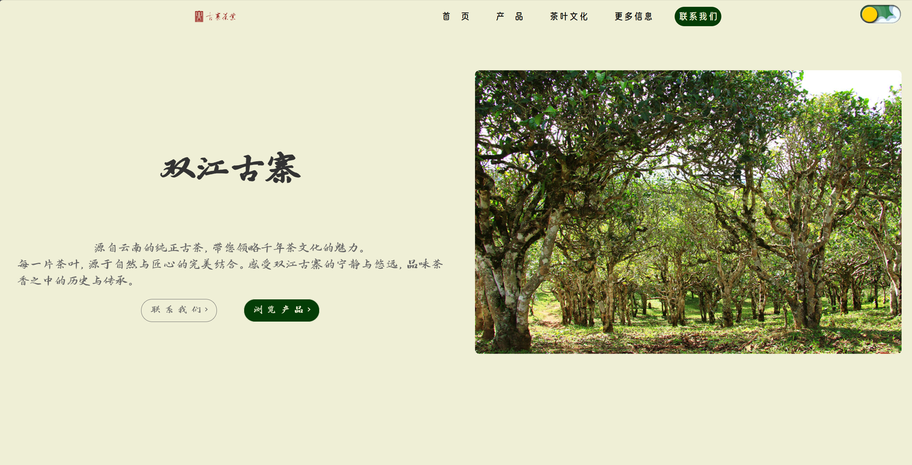
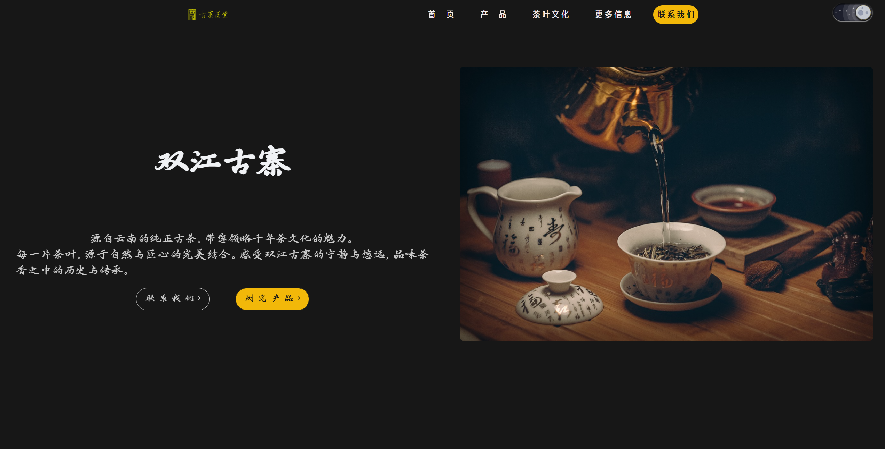
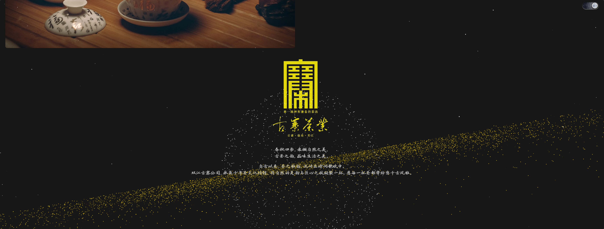
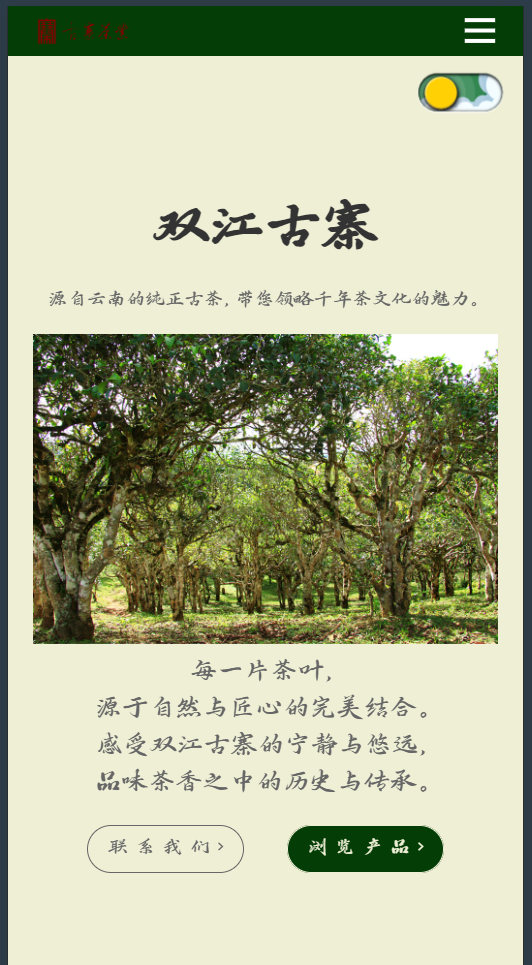
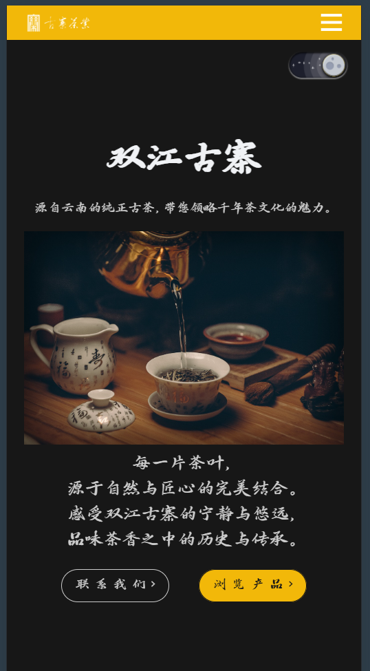
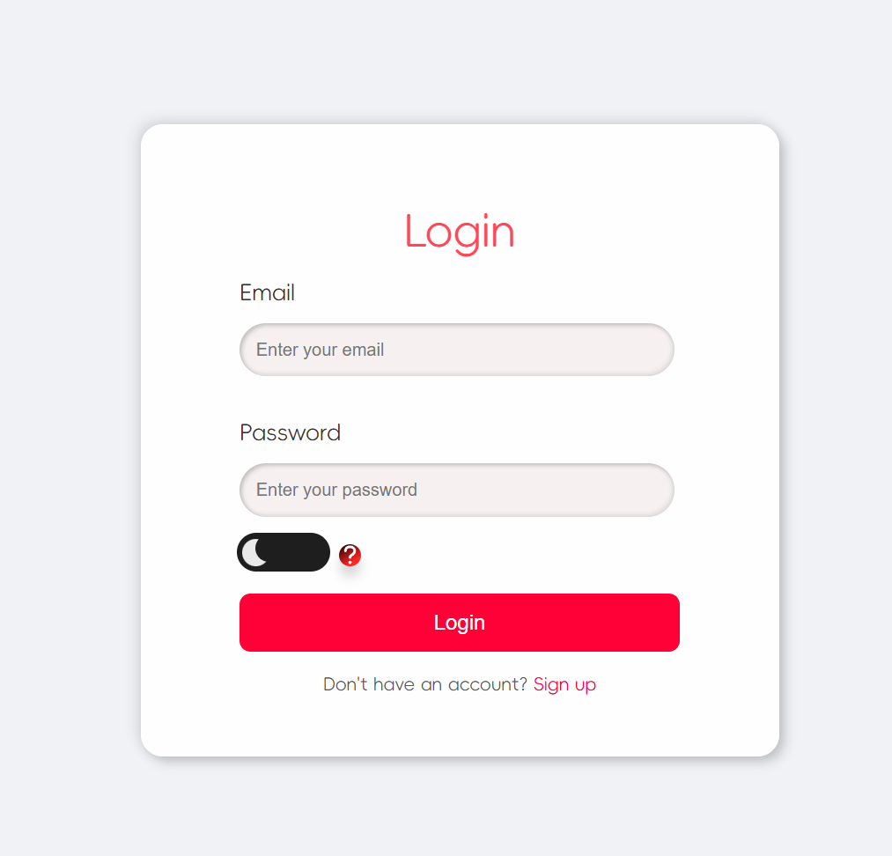
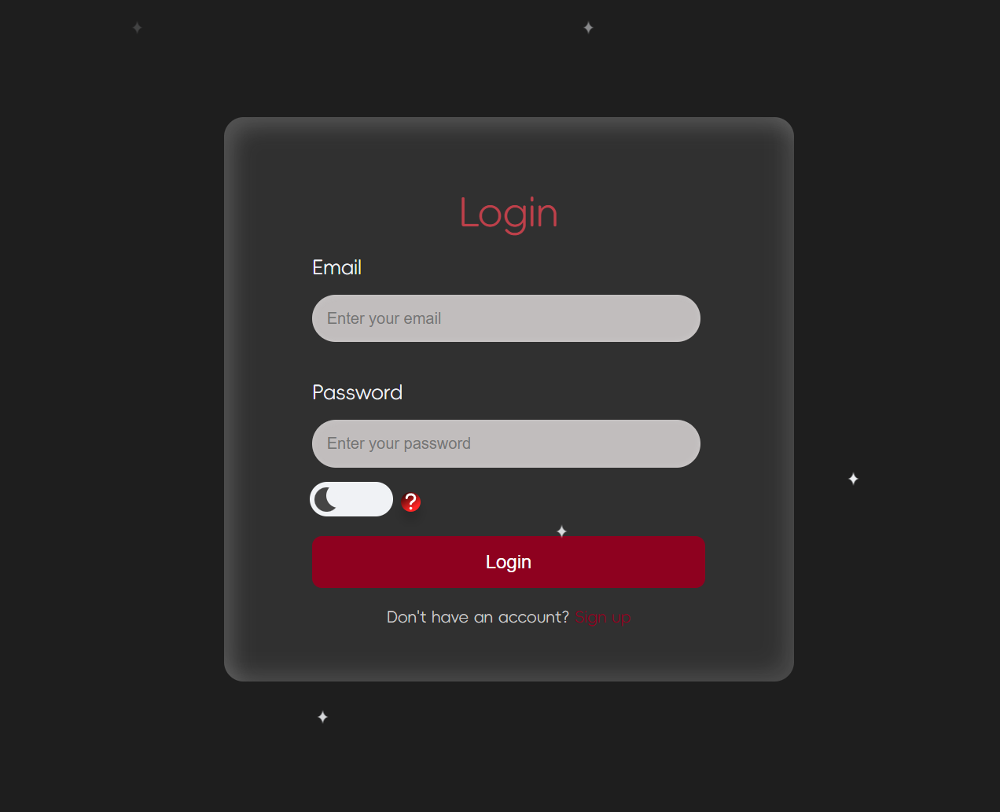
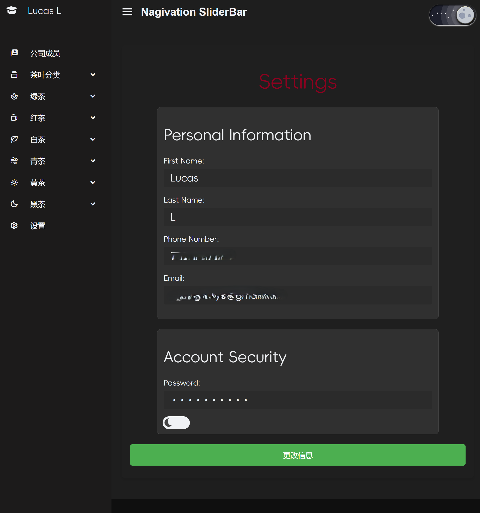
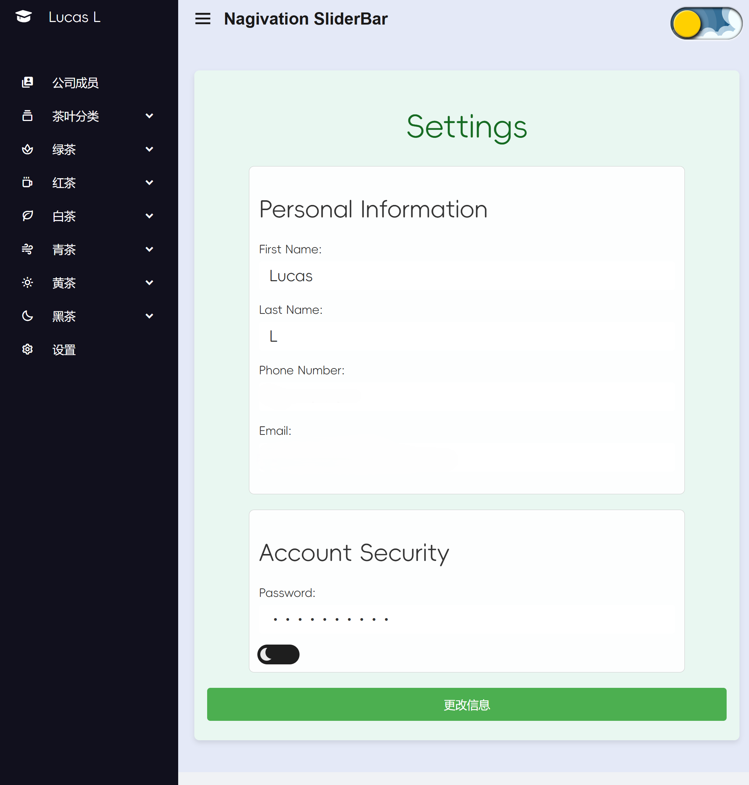
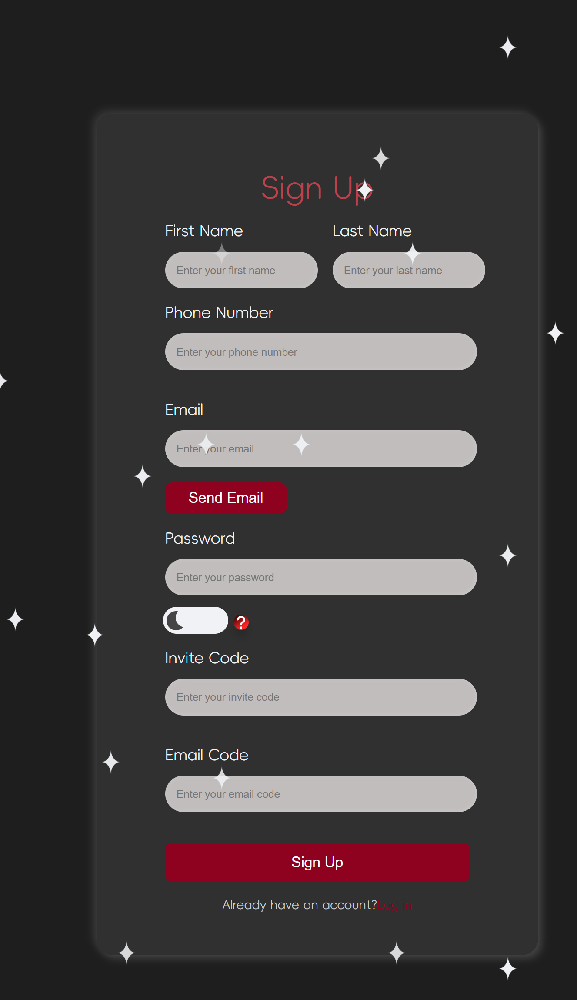

# Frontend Project - Multi-Page Application with Dark and Light Mode
### This is a multi-page frontend application built with React.js. The project includes various user interface components such as login, signup, and settings pages, along with animated effects and theme switching functionality between light and dark modes. Each page is statically served via HTML files with dynamic rendering through React Router. By the way, you can browse: www.lucaslyu.com (Not completed)

## Features
1. Multi-Page Structure: Unlike a single-page application (SPA), this project features multiple HTML pages (admin_home.html, admin.html, index.html), each with its own route and distinct React components.
2. Theme Switching: Users can toggle between dark mode and light mode across all pages.
3. Login and Signup: Secure user authentication flow, including email verification and password validation.
4. Settings Page: Users can update their personal information and manage account security.
5. Custom Animations: Stunning visual effects like fireworks and twinkling stars enhance user engagement.
6. Responsive Design: The interface is fully responsive and optimized for various screen sizes, including mobile, tablet, and desktop.
7. Token-based Authentication: JWT (JSON Web Token) is used to manage user sessions securely.

## [GO TO This WebSite](https://www.sjgztea.com)


## Project Structure
```
├── config/
├── node_modules/
├── public/
│   ├── pages/
│   │   ├── admin_home.html
│   │   ├── admin.html
│   │   ├── index.html
│   ├── glask.ico
│   ├── glask.png
│   └── manifest.json
├── scripts/
├── src/
│   ├── css/
│   │   ├── animations/
│   │   │   ├── FireworkAnimation.css
│   │   │   ├── StarsAnimation.css
│   │   ├── AdminHome.css
│   │   ├── App.css
│   │   ├── index.css
│   │   ├── Login.css
│   │   ├── NotFound.css
│   │   ├── Setting.css
│   │   ├── Signup.css
│   ├── js/
│   │   ├── components/
│   │   │   ├── AnimationComponents.jsx
│   │   │   ├── Container.jsx
│   │   │   ├── EarthStar.jsx
│   │   │   └── Firework.jsx
│   │   ├── templates/
│   │   ├── utility/
│   │   │   ├── admin_home.js
│   │   │   ├── admin.js
│   │   │   ├── index.js
│   │   ├── routers/
│   │       ├── admin_home_router.js
│   │       ├── admin_router.js
│   │       ├── index_router.js
├── test/
└── package.json
```

## Installation
1. Prerequisites
Ensure that you have the following installed:
Node.js: Version 14 or later
npm: Version 6 or later
2. Clone the Repository
```bash
    git clone https://github.com/your-repo-url.git
    cd your-repo-folder
```
3. Install Dependencies Run the following command to install project dependencies:
```bash
npm install
```
4. Running the Application
You can run the application in development mode with the following command:
```bash
npm start
The application will be accessible at http://localhost:3000.
```
5. Build for Production
To create a production build:
```bash

npm run build
This will create an optimized build of the project in the build folder.
```

## Usage
1. Login Page:
Users enter their email and password to log in. Successful login will redirect the user to the Admin Home page.
2. Sign Up Page:
Users can register by providing personal information, a password, and an invite code. They will also receive an email verification code before account creation is completed.
3. Settings Page:
Users can update personal information like first name, last name, email, and phone number. Passwords can also be updated, and account security settings can be managed.
4. Theme Toggle:
All pages support both light and dark modes. Users can switch between the two modes using a toggle button on each page.

## Screenshots
### Fronted








### Login Page (Dark Mode)

### Login Page (Light Mode)

### Settings Page (Dark Mode)

### Settings Page (Light Mode)

### Sign Up Page (Dark Mode)



